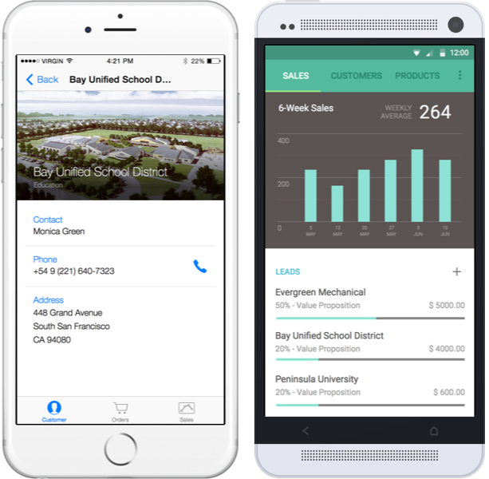

#Xamarin CRM

Xamarin CRM is a app whose imagined purpose is to serve the mobile workforce of a fictitious company that sells 3D printer hardware and supplies. The app empowers salespeople to track their sales performance, manage leads, view their contacts, manage orders, and browse the product catalog.

###Two ways to try it out:
1) You can download and build the app's source as-is, preconfigured to consume our Azure service instance. 

__OR__ 

2) You can easily create your own fully-functional (but temporary) service instance via Microsoft's Azure App Service [__Try It Now__](https://tryappservice.azure.com/en-us) experience: https://tryappservice.azure.com/en-us. Select 'Xamarin CRM' in step 2. The app source you download will be pre-configured to consume your automatically-created temporary Azure App Service instance. (Be aware that the mobile app source in the Try It Now experience may not be fully up to date. Use this repo for the latest source.)

###Supported platforms: iOS and Android

###The app architecture consists of two parts:
  1. A Xamarin.Forms mobile app for iOS and Android.
  2. A .NET Web API-backed Entity Framework based Azure Mobile Service for data.

**The Azure Mobile Service does not need to be deployed by you.** There is already an instance of the service up and running in Azure, and the mobile app is configured by default to consume that service instance. We've included the code for the service so that you may run your own service instance on Azure if you'd like.

##Xamarin.Forms app (Xamarin CRM)

####[Setup Instructions](https://github.com/xamarin/app-crm/wiki/Setup-Xamarin-CRM-app)

####[Install the app NOW without building from source code (coming soon)](https://github.com/xamarin/app-crm/wiki/Install-the-app-NOW-without-building-from-source-code)

####Featured technologies
* [Xamarin.Forms](http://xamarin.com/forms)
* [Xamarin.Forms.Maps](https://developer.xamarin.com/guides/cross-platform/xamarin-forms/user-interface/map)
* [Active Directory Authentication Library (ADAL)](https://blog.xamarin.com/put-adal-xamarin.forms)
* [Azure Mobile Service libraries](https://azure.microsoft.com/en-us/documentation/services/mobile-services)
* [Syncfusion Essential Studio charts](http://www.syncfusion.com/products/xamarin)

####Highlights

######Over 95% shared code between platforms
######Natively rendered controls
######OAuth authentication using Microsoft's ADAL (Active Directory Authentication Library)
######Beautiful charts with Syncfusion Essential Studio
######Native mapping on each platform
######Easy list views with data-binding

##Azure Mobile Service for data (.NET backend)
####[Setup Instructions](https://github.com/xamarin/app-crm/wiki/Setup-Xamarin-CRM-Azure-Mobile-Service-for-backend-data)

####Service API documentation:
######URL: https://xamarincrmv2dataservice.azure-mobile.net/help

######Credentials (for the catalog data service, NOT the app login):
**Username:** `[empty]` (literally an empty field)

**Password:** `LHlKlRaUrMiFrElKVkaEZOTlunFAkF28`
